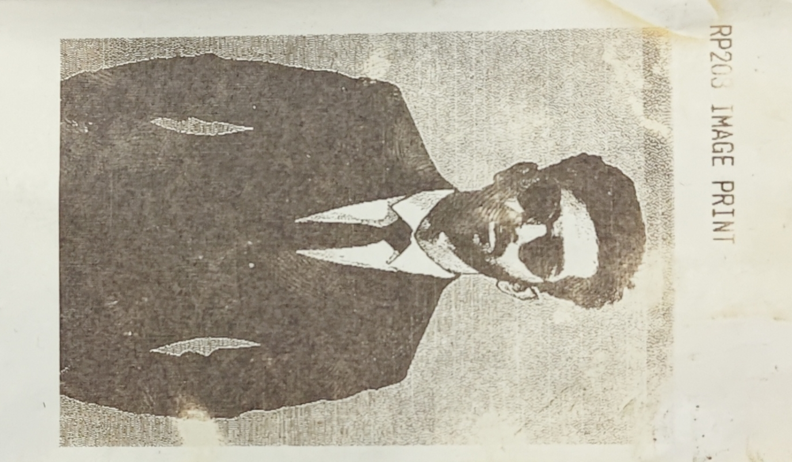
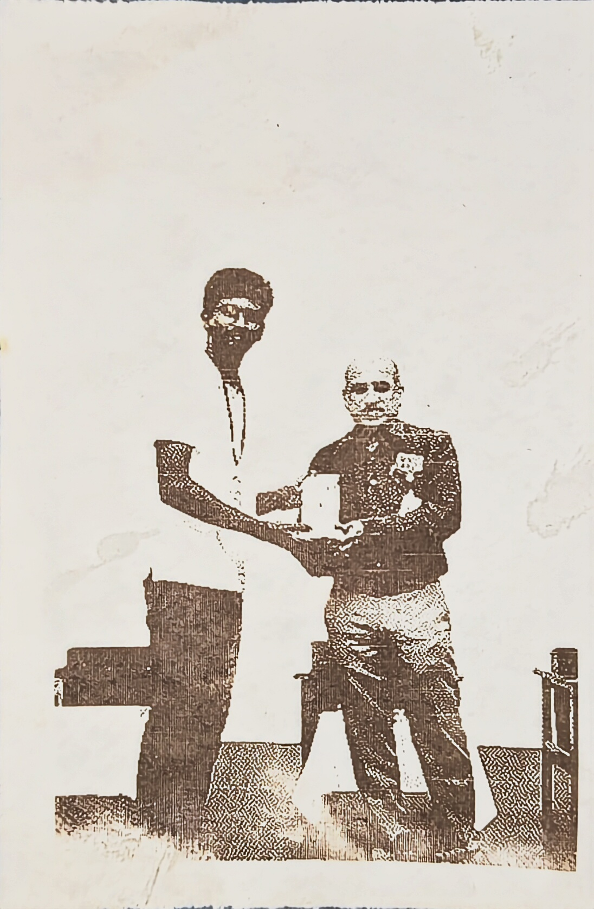
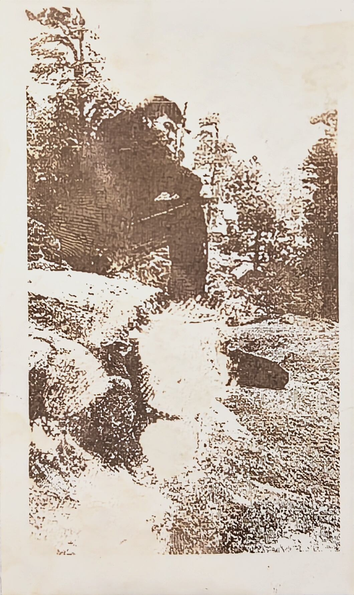

# RP203 Wi-Fi Thermal Printer

Turn any image into a print on an RP203 thermal printer, over Wi-Fi, from
your phone or laptop — no companion app required.

The project has two parts:

1. **`bit_image.py`** — a desktop GUI (Tkinter) that converts a photo into
   a 1-bit dithered bitmap sized for the printer, with live preview and
   tunable brightness/contrast/dither settings. Exports a `.h` bitmap
   header or a `.bin` file the firmware can print directly.
2. **`firmware/print_website/`** — an ESP32 sketch that drives the RP203
   over TTL serial and serves a small web page (`/`) where you can upload
   a `.bin` file and print it, from any device on the network.

| | | |
|---|---|---|
|  |  |  |

Sample thermal prints produced with this pipeline.

## How it works

```
photo (jpg/png) -> bit_image.py -> dithered 1-bit bitmap
                                        |
                         export as .h (embed in firmware)
                                or .bin (upload over Wi-Fi)
                                        |
                                 ESP32 (print_website.ino)
                                        |
                              RP203 thermal printer (TTL serial)
```

- `bit_image.py` resizes the image to the printer's dot width, applies
  autocontrast/denoise/brightness/contrast/gamma/sharpen adjustments, then
  dithers it to pure black/white using one of eight algorithms (Threshold,
  Ordered 4x4, Floyd-Steinberg, Atkinson, Sierra Lite, Sierra, Stucki,
  Jarvis-Judice-Ninke) before packing it into a 1-bit-per-pixel bitmap.
- The firmware exposes a simple web UI: upload a `.bin`, then hit
  **Print Last Image**. It stores the image in LittleFS so it survives a
  reboot and can be reprinted without re-uploading.

## Hardware

- ESP32 dev board
- RP203 thermal printer (TTL serial input)
- Wiring: ESP32 GPIO16 (RX) <- Printer TX, ESP32 GPIO17 (TX) -> Printer RX,
  shared GND. Printer runs on its own 5V supply (thermal printers draw a
  lot of current while printing — don't power it from the ESP32's 5V pin).

## Getting started

### 1. Image converter (`bit_image.py`)

```bash
pip install -r requirements.txt
python bit_image.py
```

Load an image, adjust the sliders until the paper preview looks right, then
either:
- **Export Header** — writes a `.h` file with the bitmap as a C array, to
  compile directly into firmware (handy for a fixed splash image).
- **Save Preview PNG** — for checking how it'll look before printing.

To send an image over Wi-Fi you'll want a `.bin` export in the format the
firmware expects (2 bytes width-in-bytes, 2 bytes height, then the packed
bitmap bytes) — see `pack_bitmap()` in `bit_image.py` for the packing
logic; wire it up to a "Save Bin" button or a small script if you want that
workflow instead of flashing a header each time.

### 2. Firmware (`firmware/print_website/`)

1. Copy `config.example.h` to `config.h` in the same folder and fill in
   your Wi-Fi SSID/password. `config.h` is gitignored so your credentials
   stay local.
2. Open `print_website.ino` in the Arduino IDE (or PlatformIO) with the
   ESP32 board package installed.
3. Install the `LittleFS` and `WebServer` libraries if not already present.
4. Flash it. On boot it connects to your Wi-Fi and also starts a fallback
   access point (`RP203-Printer`, see `config.h`) in case the Wi-Fi
   connection fails.
5. Check the Serial Monitor (115200 baud) for the assigned IP address, or
   connect to the fallback AP.
6. Visit the printer's IP in a browser, upload a `.bin` file, and press
   **Print Last Image**.

### Web endpoints

| Route | Method | Description |
|---|---|---|
| `/` | GET | Status page + upload form |
| `/upload` | POST | Upload a `.bin` bitmap (multipart form, field `imgfile`) |
| `/print` | GET | Print the currently stored bitmap |
| `/clear` | GET | Delete the stored bitmap |
| `/status` | GET | JSON status (ready, dimensions, IP addresses) |

## Bitmap format (`.bin`)

```
byte 0-1: width in bytes  (little-endian)
byte 2-3: height in pixels (little-endian)
byte 4..: packed 1-bit-per-pixel rows, MSB first
```

## Printer tuning

Heating parameters (`HEAT_MAX_DOTS`, `HEAT_TIME`, `HEAT_INTERVAL`) are set
near the top of `print_website.ino` and sent to the printer via the
standard ESC/POS heating command on boot. Adjust these if prints come out
too light, too dark, or the printer stalls/overheats.

## Project structure

```
.
├── bit_image.py                       # image -> dithered bitmap GUI
├── requirements.txt
├── firmware/
│   └── print_website/
│       ├── print_website.ino          # ESP32 web server + printer driver
│       └── config.example.h           # copy to config.h with your Wi-Fi creds
└── examples/                          # sample thermal prints
```

## License

Add a license of your choice (e.g. MIT) if you want others to reuse this
freely — see [choosealicense.com](https://choosealicense.com/).
